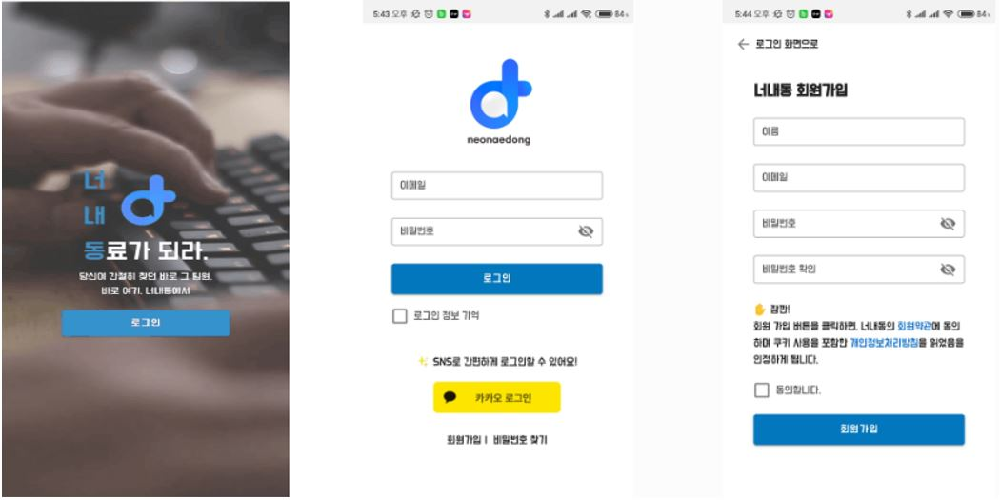
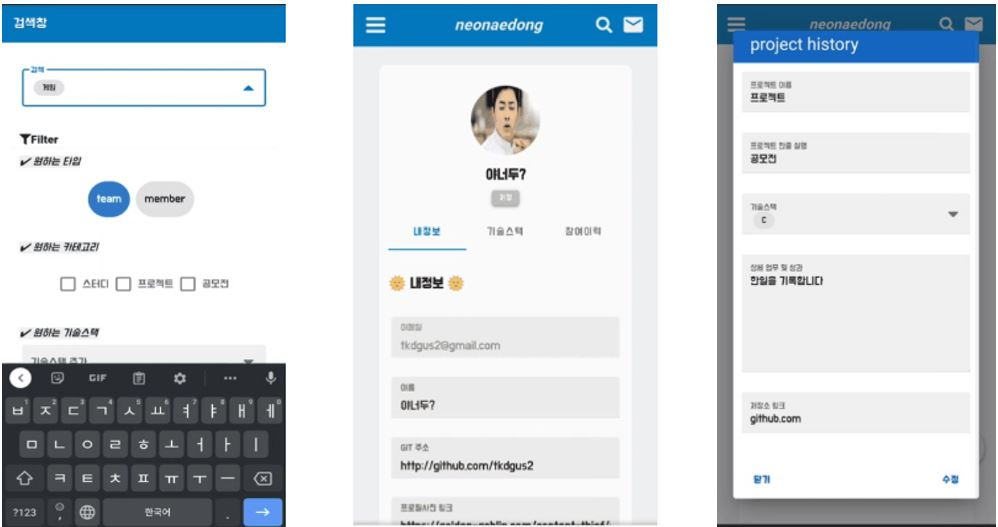
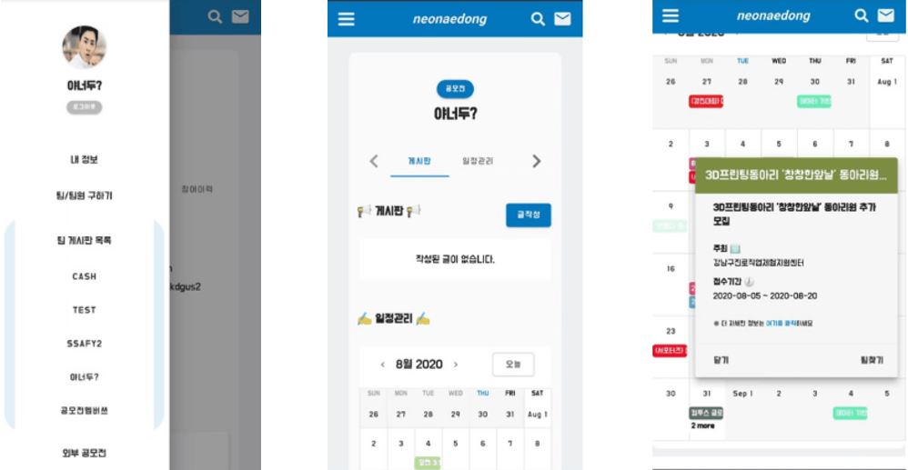

<h1 align="center"> 너 내 동료가 되라! 👋</h1>
<p>
  <a href="http://i3a404.p.ssafy.io/" target="_blank">
  
  </a>
  <a href="http://i3a404.p.ssafy.io/" target="_blank">
    
  </a>
</p><br/>


<p align=center>
  <b>팀 , 팀원 구하기 막막할 때, 자신이 원하는 기술, 공모전 스터디 등을 확인하세요. 또한 상대방의 프로필을 관찰하고 팀을 구성하세요</b><br>📱💻🖥
</p>


## Tech Stack

<div>
    <a href="https://github.com/naver/egjs-flicking/blob/master/packages/ngx-flicking/README.md"></a>&nbsp;&nbsp;
    <a href="https://github.com/naver/egjs-flicking/blob/master/packages/vue-flicking/README.md"></a>&nbsp;&nbsp;
    <a href="https://github.com/naver/egjs-flicking/blob/master/packages/vue-flicking/README.md"></a>
</div>


<div>
    <a href="https://github.com/naver/egjs-flicking/blob/master/packages/vue-flicking/README.md"></a>&nbsp;&nbsp;
    <a href="https://github.com/naver/egjs-flicking/blob/master/packages/vue-flicking/README.md"></a>&nbsp;&nbsp;
    <a href="https://github.com/naver/egjs-flicking/blob/master/packages/vue-flicking/README.md"></a>&nbsp;&nbsp;
    <a href="https://github.com/naver/egjs-flicking/blob/master/packages/react-flicking/README.md"></a>&nbsp;&nbsp;
    <a href="https://github.com/naver/egjs-flicking/blob/master/packages/react-flicking/README.md"></a> 
</div>

## Install

```sh
yarn install
```

## Usage

```sh
yarn serve
```


## 📖 Documentation


* 웰컴페이지 / 로그인 / 회원가입




* 메인화면 / 팀 지원 및 팀 생성을 할 수 있고 상대방 프로필을 확인 할 수 있습니다.


* 원하는 키워드로 게시물을 찾을 수 있고 내정보를 수정 할 수 있습니다.




* 팀게시판 목록을 관리 할 수 있습니다.(게시판 글 등록 및 일정 관리, 팀원 평가) / 외부 공모전을 찾아 볼 수 있습니다.




## 🌐 Supported Browsers
|||||
|:---:|:---:|:---:|:---:|
|10+|Latest|7+|4+|


## Contributors

Team: 이상한 나라의 앨리스
* [오기석](https://lab.ssafy.com/ohks9208)은 DB 구현 및 FrontEnd와의 연결을 도왔습니다.
* [함지훈](https://lab.ssafy.com/logbug1004)은 DB 설계 및 API 구현을 도왔습니다.
* [김성현](https://lab.ssafy.com/tjdgus2319)은 JWT 보안 및 API 구현을 도왔습니다.
* [박지윤](https://lab.ssafy.com/bellnuite)은 디자인 통합 및 내정보 페이지를 구현했습니다.
* [이창윤](https://lab.ssafy.com/tony95k)은 팀게시판 및 뉴스피드를 구현했습니다.
* [이상현]()은 와이어 프레임 작성 및 외부공모전을 구현했습니다.

***
## 📜 License

```
Copyright (c) 2020 s03-webmobile2-sub3

Permission is hereby granted, free of charge, to any person obtaining a copy
of this software and associated documentation files (the "Software"), to deal
in the Software without restriction, including without limitation the rights
to use, copy, modify, merge, publish, distribute, sublicense, and/or sell
copies of the Software, and to permit persons to whom the Software is
furnished to do so, subject to the following conditions:

The above copyright notice and this permission notice shall be included in all
copies or substantial portions of the Software.

THE SOFTWARE IS PROVIDED "AS IS", WITHOUT WARRANTY OF ANY KIND, EXPRESS OR
IMPLIED, INCLUDING BUT NOT LIMITED TO THE WARRANTIES OF MERCHANTABILITY,
FITNESS FOR A PARTICULAR PURPOSE AND NONINFRINGEMENT. IN NO EVENT SHALL THE
AUTHORS OR COPYRIGHT HOLDERS BE LIABLE FOR ANY CLAIM, DAMAGES OR OTHER
LIABILITY, WHETHER IN AN ACTION OF CONTRACT, TORT OR OTHERWISE, ARISING FROM,
OUT OF OR IN CONNECTION WITH THE SOFTWARE OR THE USE OR OTHER DEALINGS IN THE
SOFTWARE.

```